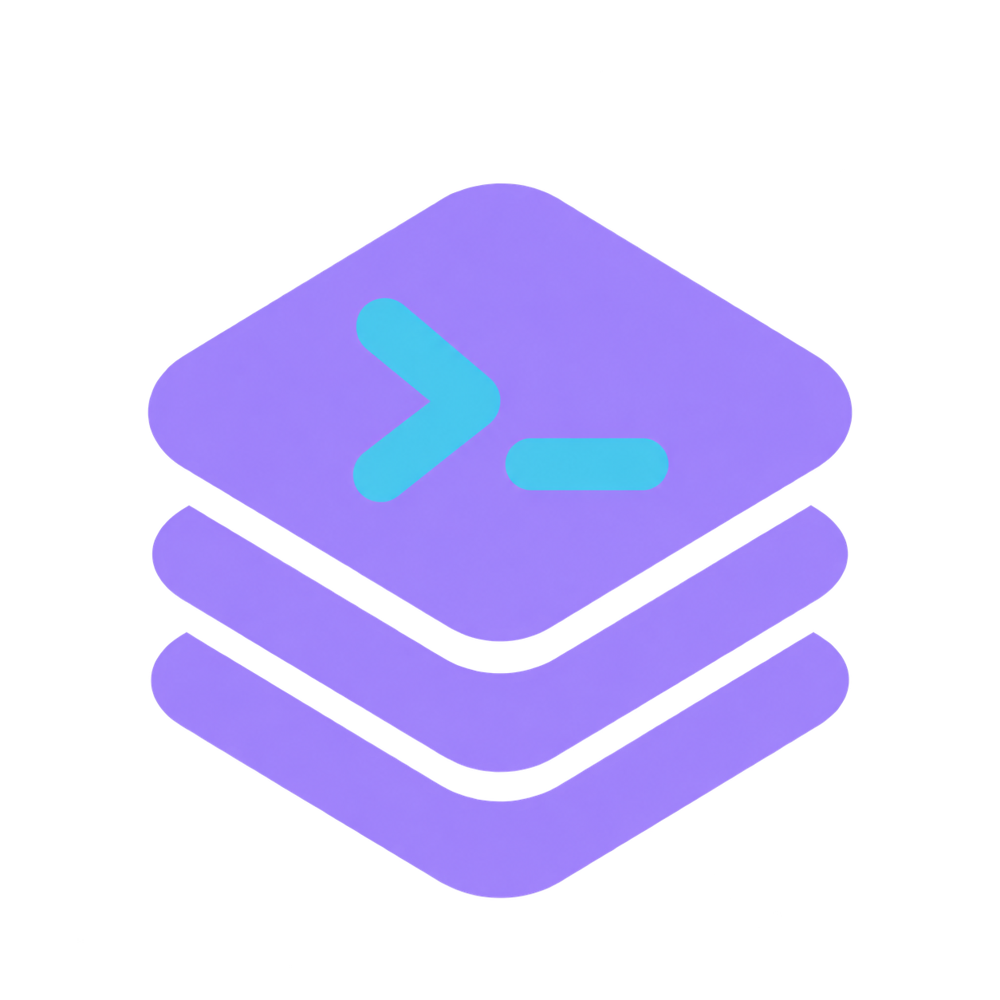
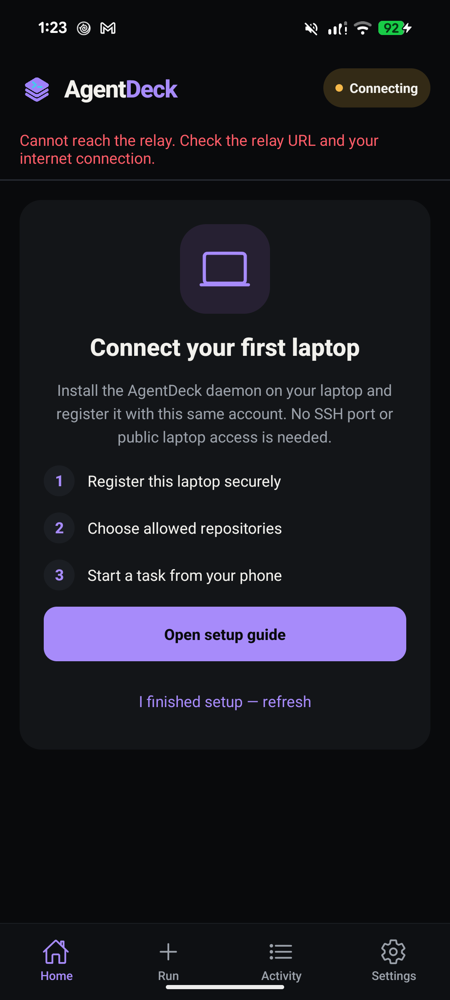
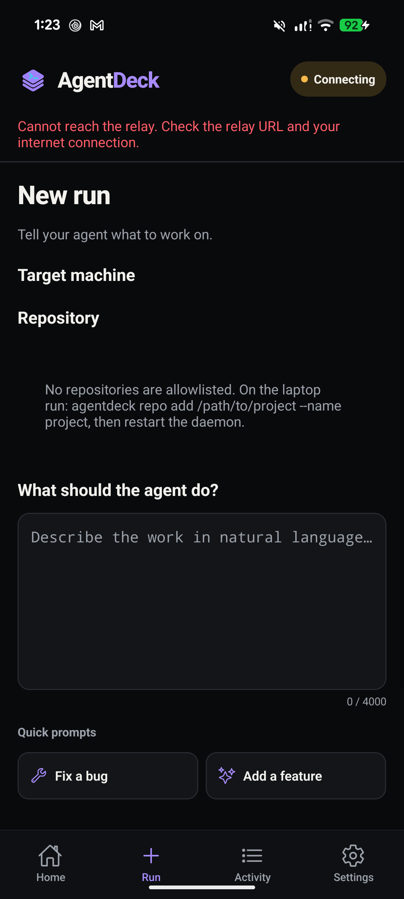
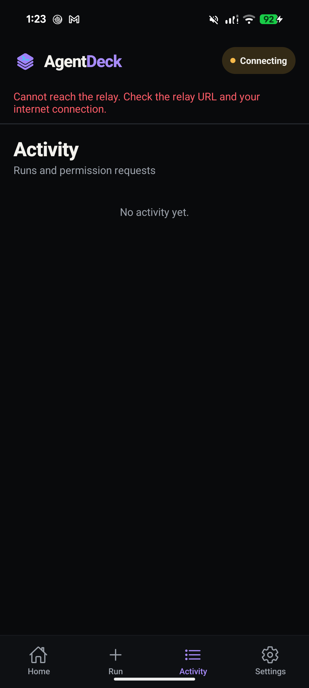
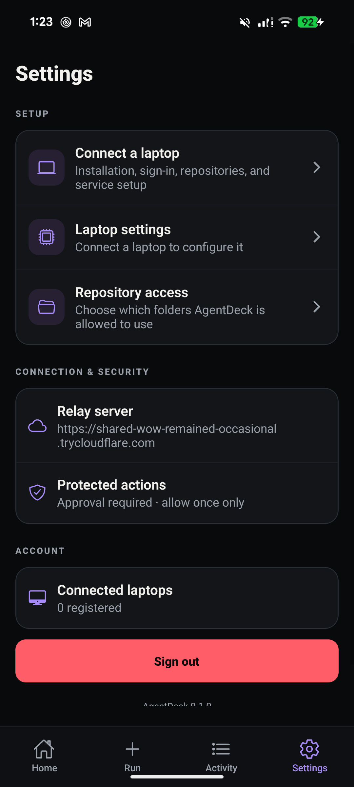

# AgentDeck

<p align="center">
  
</p>

<p align="center">
  <strong>Your coding agents. On your machines. In your hands.</strong>
</p>

<p align="center">
  Securely start, monitor, and continue Codex or Claude Code sessions from an Android phone—without exposing SSH or opening an inbound port on your laptop.
</p>

<p align="center">
  
  
  
  
  
</p>

## The app

<table>
  <tr>
    <td align="center"></td>
    <td align="center"></td>
    <td align="center"></td>
    <td align="center"></td>
  </tr>
  <tr>
    <td align="center"><strong>Home</strong><br />Machines and recent work</td>
    <td align="center"><strong>Run</strong><br />Choose a repo and delegate</td>
    <td align="center"><strong>Activity</strong><br />Runs and approvals</td>
    <td align="center"><strong>Settings</strong><br />Access and security</td>
  </tr>
</table>

> Screenshots are captured from the production APK running on a physical Pixel 8. The relay shown was offline during capture, demonstrating the app's disconnected state.

## What AgentDeck does

- Runs **Codex** and **Claude Code** on your laptop while you control the session from your phone.
- Limits agents to repositories explicitly allowlisted on the laptop.
- Streams agent messages, command output, progress, and results in real time.
- Keeps sensitive actions behind an explicit **Allow once / Deny** approval flow.
- Supports follow-up prompts, session continuation, cancellation, changed-file summaries, and diffs.
- Handles temporary network loss through reconnecting WebSockets and a durable laptop outbox.
- Supports multiple laptops with independent, revocable device credentials.

## How it works

```text
┌─────────────────┐       HTTPS / WSS       ┌──────────────────┐
│  Android phone  │ ◀─────────────────────▶ │  FastAPI relay   │
│  React Native   │                         │  + PostgreSQL     │
└─────────────────┘                         └────────┬─────────┘
                                                   │ authenticated WSS
                                          outbound │ connection only
                                                   ▼
                                          ┌──────────────────┐
                                          │ Laptop daemon    │
                                          │ ├─ allowlist     │
                                          │ ├─ Codex         │
                                          │ └─ Claude Code   │
                                          └──────────────────┘
```

The laptop initiates an encrypted outbound connection to the relay. The phone never connects directly to the laptop, and AgentDeck does not expose an SSH port or laptop-hosted HTTP service.

Read the detailed [architecture](docs/architecture.md), [wire protocol](docs/protocol.md), [security model](docs/security.md), and [deployment guide](docs/deployment.md).

## Quick start

### 1. Prepare the laptop

Requirements:

- Linux with systemd
- Python 3.10+
- Git
- An authenticated Codex and/or Claude Code CLI

Run the guided installer from the repository root:

```bash
./setup.sh
```

The installer asks for your AgentDeck account, laptop name, and a directory containing Git repositories. It installs the daemon, discovers repositories, configures its service, and prints the HTTPS relay URL for the phone.

Show the current relay URL again at any time:

```bash
~/.local/bin/agentdeck-url
```

### 2. Install the Android app

Install [AgentDeck-Concept-C.apk](AgentDeck-Concept-C.apk) on an Android 7.0 or newer phone. If Android blocks the install, allow **Install unknown apps** for the file manager or browser you used to open it.

Enter the exact relay URL printed by the laptop installer, then sign in with the same account.

### 3. Delegate work

Open **Run**, select an online laptop and allowlisted repository, describe the task, and choose **Run with Codex** or the laptop's configured default agent. Live output appears in the session screen; protected actions pause until you approve or deny them.

## Manual server setup

Use this path for development, self-hosting, or a permanent relay:

```bash
python3 -m venv .venv
.venv/bin/pip install -e '.[dev]'
cp .env.example .env
# Replace every example secret in .env.
docker compose up --build -d
```

Create the first account in the app or through `POST /api/v1/auth/register`, then register a laptop:

```bash
.venv/bin/agentdeck login \
  --server https://relay.example.com \
  --email you@example.com \
  --name "Personal laptop" \
  --label Personal

.venv/bin/agentdeck repo add ~/projects/my-project --name my-project
.venv/bin/agentdeck daemon
```

Allowlist every Git repository under a directory:

```bash
.venv/bin/agentdeck repo discover ~/Documents
```

### Run the daemon as a user service

```bash
mkdir -p ~/.config/systemd/user
cp deploy/agentdeck.service ~/.config/systemd/user/
systemctl --user daemon-reload
systemctl --user enable --now agentdeck
loginctl enable-linger "$USER"
```

Check its status:

```bash
systemctl --user status agentdeck
```

## Free cross-network testing

Start a temporary Cloudflare Quick Tunnel:

```bash
./scripts/start-public-relay.sh
```

The script prints an `https://…trycloudflare.com` URL. Use that exact URL on the phone and when connecting other laptops:

```bash
./scripts/connect-laptop.sh URL ~/Documents
```

Quick Tunnel URLs change when the tunnel restarts, and the relay laptop must stay online. For a stable production URL, deploy the relay to an always-on host with a named domain or tunnel.

## Mobile development

```bash
cd mobile-app
npm install
npm run android
```

Set `expo.extra.apiUrl` in `mobile-app/app.json` to an HTTPS relay reachable from the phone. The sign-in screen also accepts a relay URL, which is useful for LAN testing. Production deployments should use HTTPS; AgentDeck derives the matching secure WebSocket URL automatically.

Build a self-contained release APK:

```bash
cd mobile-app
NODE_ENV=production ./android/gradlew -p android assembleRelease
```

The output is written to `mobile-app/android/app/build/outputs/apk/release/app-release.apk`.

> The checked-in Android release configuration currently uses the development signing key. Configure a private production keystore before publishing the app.

## Verification

Run the full project checks before shipping changes:

```bash
.venv/bin/ruff check server client shared migrations
.venv/bin/pytest

cd mobile-app
npm run typecheck
npm test

cd ..
docker compose config
```

For physical-device verification:

```bash
adb devices
adb install -r AgentDeck-Concept-C.apk
adb shell monkey -p com.agentdeck.mobile \
  -c android.intent.category.LAUNCHER 1
```

## Security model

| Control | Protection |
|---|---|
| Network exposure | Laptop makes an outbound WSS connection; no inbound laptop port is opened |
| Authentication | 15-minute access JWTs and rotated, hashed refresh tokens |
| Device trust | Unique high-entropy credentials, hashed on the relay and individually revocable |
| Filesystem scope | Canonical repository allowlist with symlink and traversal checks |
| Agent execution | Codex receives workspace-only filesystem access |
| Sensitive actions | Push, deploy, migration, and destructive requests require phone approval |
| Rendering | Agent output is displayed as plain selectable text, never executable HTML |
| Auditability | Permission requests and decisions are stored as audit records |

Logs may contain source code or terminal output. Treat relay database access, backups, and retention as sensitive. See [docs/security.md](docs/security.md) for the full threat boundary.

## Troubleshooting

### The app says “Cannot reach the relay”

1. Run `~/.local/bin/agentdeck-url` and compare the complete URL with the app's **Settings → Relay server** value.
2. Verify the relay process or container is running.
3. If using a Quick Tunnel, restart it and update the phone when its URL changes.
4. Confirm the phone has internet access and the relay URL opens over HTTPS.

### The laptop appears offline

```bash
systemctl --user status agentdeck
systemctl --user restart agentdeck
```

Confirm that the laptop uses the same relay URL and account as the phone.

### No repositories appear

```bash
agentdeck repo list
agentdeck repo discover ~/Documents
# or
agentdeck repo add /path/to/project --name project
systemctl --user restart agentdeck
```

Only explicitly allowlisted Git repositories appear in the app.

## Repository map

| Path | Purpose |
|---|---|
| `mobile-app/` | Expo and React Native Android client |
| `server/` | FastAPI REST API, WebSocket relay, authentication, and audit logic |
| `client/` | Laptop daemon, CLI, local state, and coding-agent adapters |
| `shared/` | Versioned Pydantic message protocol |
| `migrations/` | Alembic database migrations |
| `deploy/` | systemd service definitions |
| `scripts/` | Relay and laptop connection helpers |
| `docs/` | Architecture, protocol, security, and deployment references |

## Current constraints

- The relay is currently designed for one application replica because live WebSocket ownership is process-local. Horizontal scaling requires a Redis or NATS connection registry and message backplane.
- The Android client is the primary mobile target.
- A laptop must remain powered on for its local coding agents to run.

---

<p align="center">
  <strong>Build on your laptop. Stay in control from anywhere.</strong>
</p>
